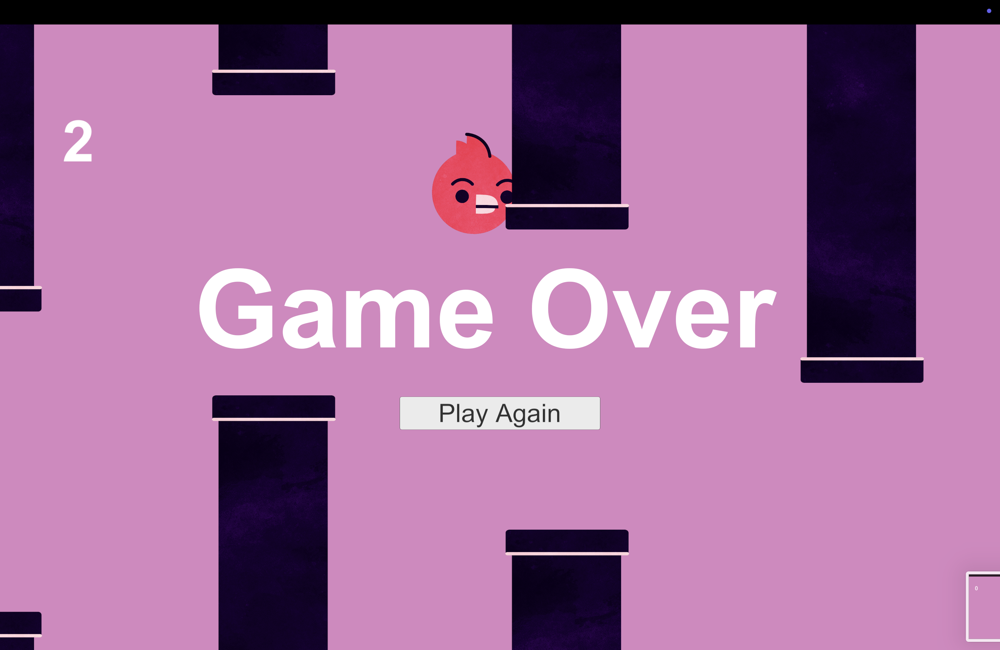
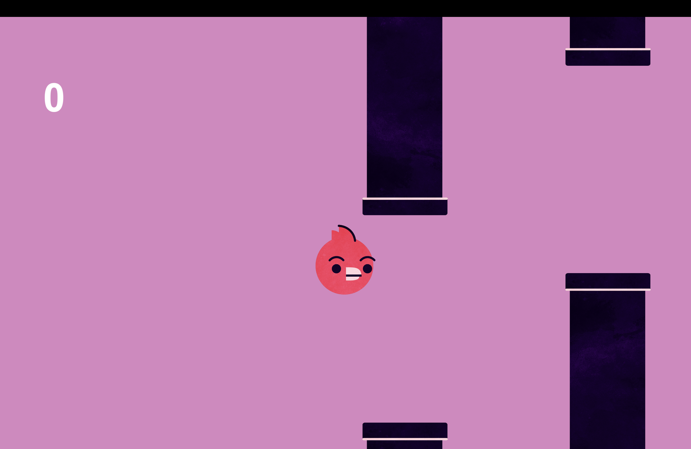
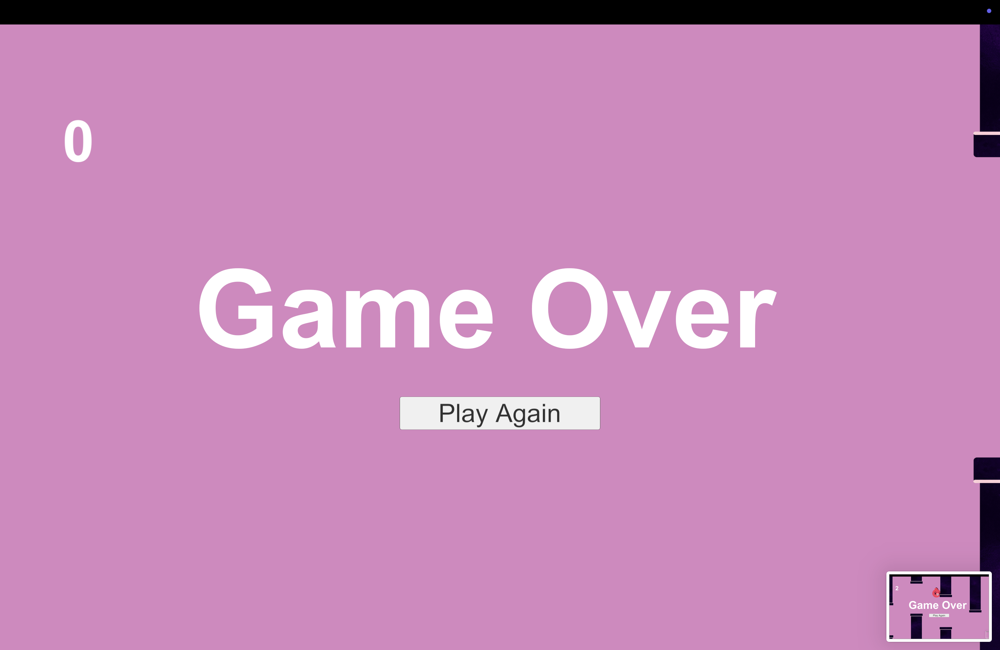

# Unity Flappy Bird Clone

A simple clone of the classic Flappy Bird game, built using Unity 2D. 
This project is intended for learning and experimenting with Unity game development fundamentals, including physics, collisions, UI, and basic game logic.

---

## Features

- Tap or press spacebar to make the bird flap
- Procedurally spawning pipes with gaps
- Score tracking as the bird passes through pipes
- Game Over screen triggered on collision or falling below screen
- Restart functionality with a single button
- Clean UI built using Unity Canvas system

---
## Screenshots

### Gameplay Preview

## How to Run

1. Clone or download this repository.
2. Open **Unity Hub**.
3. Click **"Add"** and select this project folder.
4. Open the project in Unity.
5. Press **Play** in the Unity Editor to start the game.

---

## Built With

- **Unity** (2D)
- **C#**
- Unity UI System (Canvas, Text, Button)
- Rigidbody2D and Collider2D components
